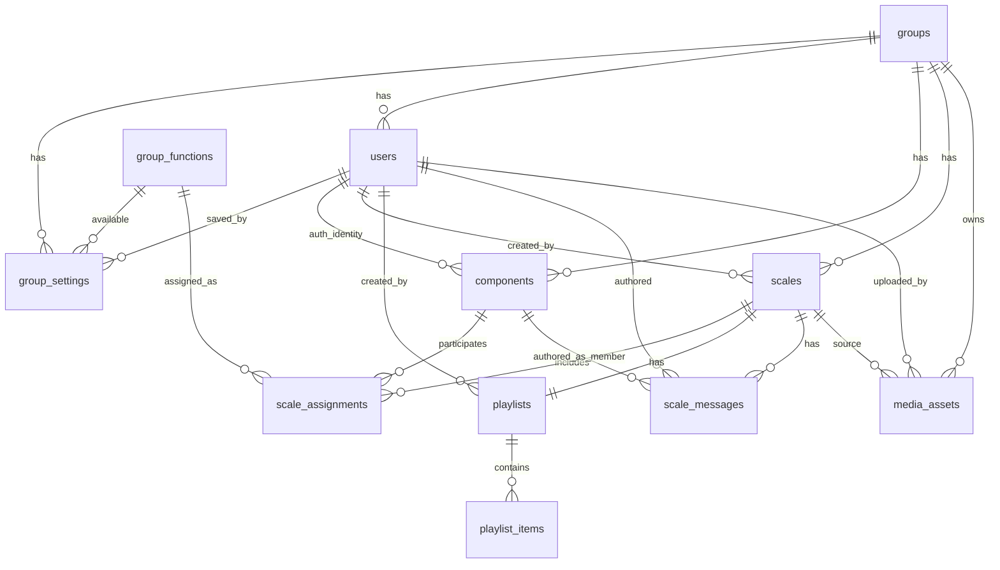

# Fluxo completo de implementação - Estrutura MongoDB (Escalas App)

## 1) Premissas e contexto atual

Mapeamento baseado no estado atual do projeto (UI + rotas API + dados mock):

- Login de grupo e login administrativo (`/login`, `/admin/login`).
- Listagem administrativa de grupos (`/admin/grupos`) com status ativo/inativo.
- Configurações gerais de grupo: nome, foto, tema, funções disponíveis (`/configuracoes-gerais-grupo`).
- Cadastro de componentes (membros): foto, nome, data de nascimento, usuário, senha (`/cadastro-componentes`).
- Cadastro de escalas: data, turno, seleção de componentes, função por componente, playlist YouTube (`/cadastro-escalas`).
- Feed de escalas: componentes por função, comentários, playlist, imagens vinculadas, ação de notificação e edição (`/escalas`).
- Busca e preview de vídeos do YouTube (`/api/youtube/search`, `/api/youtube/preview`).

## 2) Padrões de acesso priorizados

- Buscar escalas por grupo + data/turno (timeline do feed).
- Carregar detalhes da escala (componentes escalados, playlist, mensagens, imagem).
- Cadastrar componente e vincular credencial de login.
- Salvar configurações gerais do grupo e tema atual.
- Listar grupos no admin por status.
- Inserir comentário em escala em ordem cronológica.

## 3) Proposta de modelo (collections)

1. `groups`
- Entidade principal de grupo/ministerio.
- Referencia mídia de foto por `photoAssetId`.

2. `group_functions`
- Catálogo global de funções (vocal, guitarra etc).

3. `group_settings`
- Configuração vigente do grupo.
- Referencia `groupId`, `availableFunctionIds[]`, `savedByUserId`.

4. `users`
- Identidade/autenticação para admin, group_owner e component.
- `groupId` opcional (admin global pode ser `null`).

5. `components`
- Pessoa escalável (membro/componente).
- Referencia `groupId`, `authUserId`, `photoAssetId`.

6. `scales`
- Cabeçalho da escala (data, turno, status, permissão de edição).
- Referencia `groupId`, `createdByUserId`, `imageAttachmentId`.

7. `scale_assignments`
- Relacionamento N:N entre `scales` e `components`.
- Referencia função por `functionId` e marca `isLeader`.

8. `playlists`
- Playlist da escala (1:1 com escala).

9. `playlist_items`
- Itens da playlist (1:N), com metadados do YouTube.

10. `scale_messages`
- Comentários/mensagens da escala em ordem cronológica.
- Referencia autor por `authorUserId` e opcionalmente `authorComponentId`.

11. `media_assets`
- Imagens de grupo, componente e escala.
- Permite rastrear origem (`upload`, `preset`, `external`) e reuso.

## 4) Diagrama lógico (ObjectId references)



## 5) Regras de modelagem (embed vs reference)

- **Reference** para entidades que crescem sem limite ou têm ciclo de vida próprio:
  - `scale_messages`, `playlist_items`, `scale_assignments`, `media_assets`.
- **Embed leve** apenas para payload simples de mensagem:
  - `payload.text` em `scale_messages`.
- **Origem da verdade**:
  - Componente: `components`.
  - Configuração do grupo: `group_settings` (versão vigente).
  - Escala: `scales` + coleções satélite por referência.

## 6) Fluxo de implementação sugerido

1. Executar criação do schema e índices:
```bash
mongosh < docs/database/mongodb/01-create-database-and-collections.js
```

2. Executar seed de dados:
```bash
mongosh < docs/database/mongodb/02-seed-sample-data.js
```

3. Validar cardinalidade e joins básicos:
```javascript
use escalas_app

db.scales.aggregate([
  { $match: { shift: 'Manha' } },
  { $lookup: { from: 'scale_assignments', localField: '_id', foreignField: 'scaleId', as: 'assignments' } },
  { $lookup: { from: 'playlists', localField: '_id', foreignField: 'scaleId', as: 'playlist' } }
])
```

4. Migrar camada de dados da aplicação (próxima fase):
- Trocar `src/data/*.js` por leitura MongoDB via repositórios/serviços.
- Persistir ações hoje locais (comentários, imagem da escala, cadastro de escala/componente).
- Substituir auth mock por validação real na collection `users`.

## 7) Riscos e mitigação

- Senha em texto puro nos mocks atuais: armazenar apenas `passwordHash` no banco.
- Crescimento de mensagens por escala: manter coleção dedicada e índice composto `scaleId + createdAt`.
- Reuso de imagem entre escalas: centralizar em `media_assets` e referenciar por `imageAttachmentId`.

## 8) Artefatos gerados

- Script de criação: `docs/database/mongodb/01-create-database-and-collections.js`
- Script de seed: `docs/database/mongodb/02-seed-sample-data.js`
